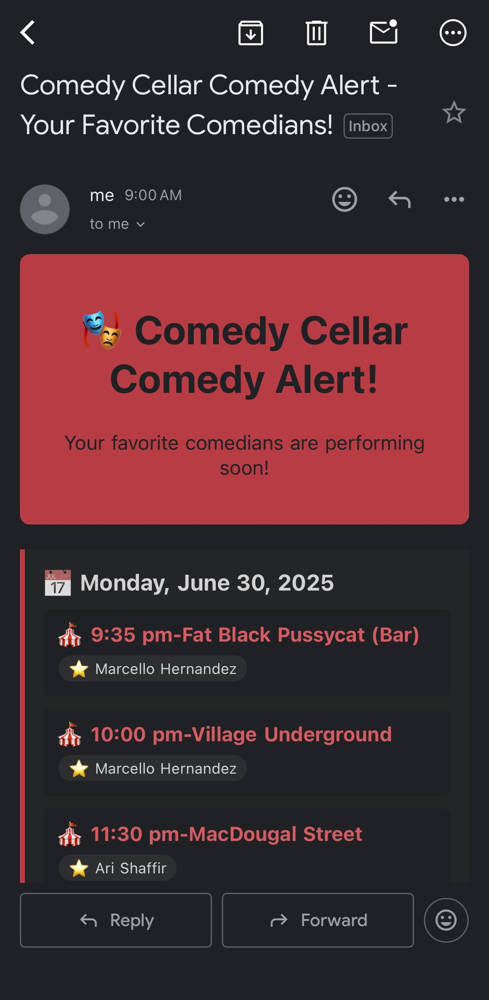

# comedy-show-bots

## Project Overview
This chalice app fetches show data from comedy venue APIs, checks for shows where favorite comedians are performing, and sends daily email alerts at 9am with this information.

## Example Email



## Deploying

To deploy the comedy-show-bots, run the following command:

```
chalice deploy --profile <profile_name>
```

## Invoking

To manually invoke your lambda function, run:

```
echo '{
  "id": "53dc4d37-cffa-4f76-80c9-8b7d4a4d2eaa",
  "detail-type": "Scheduled Event",
  "source": "aws.events",
  "account": "123456789012",
  "time": "2019-10-08T16:53:06Z",
  "region": "us-east-1",
  "resources": [ "arn:aws:events:us-east-1:123456789012:rule/MyScheduledRule" ],
  "detail": {},
  "version": ""
}' | chalice invoke -n check_comedy_shows --profile <profile_name>
```